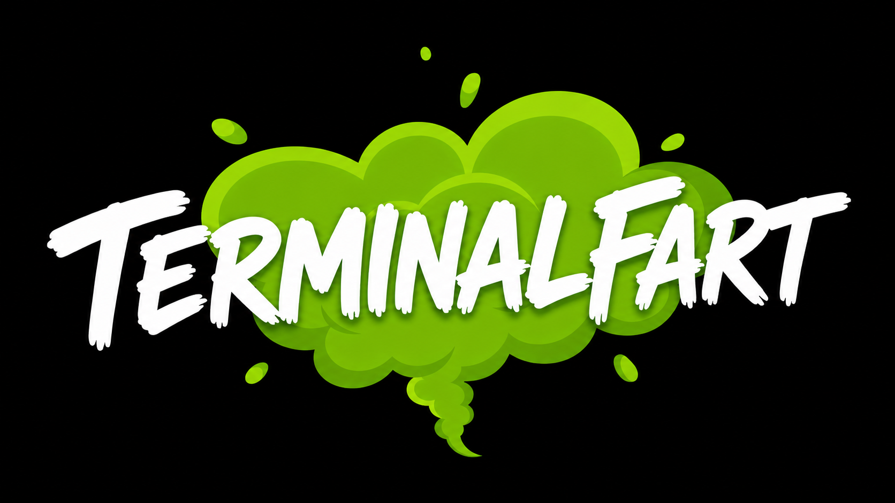

# Fartee

When your terminal fails, it rips one.

A tiny CLI that plays sounds when terminal commands, builds, or tests need your attention.

```bash
npm install -g terminalfart
terminalfart install
```

Restart your terminal. Then run commands like normal:

```bash
npm test
npm run build
git push
bad-command
```

Failed commands keep the real error visible, then play a mapped fart sound.

Commands that run for 2+ minutes play a done sound. Normal success is silent unless you turn it on.

## Install

```bash
npm install -g terminalfart
terminalfart install
```

Updating from an older version?
Run `terminalfart install` again so your shell hook passes duration and event data.

TerminalFart auto-detects `bash`, `zsh`, or PowerShell.

To choose a shell yourself:

```bash
terminalfart install bash
terminalfart install zsh
terminalfart install powershell
```

Check install status:

```bash
terminalfart status
```

Uninstall:

```bash
terminalfart uninstall
```

## Sounds

TerminalFart picks a sound from the failed command:

```txt
warning or lint failure     toot
test failure                dry
build failure               wet
command not found           poop-toot
git push reject             hellacious
```

For other failures, it falls back from the exit code.

List the bundled sounds:

```bash
terminalfart --list-sounds
```

Turn on success sounds:

```bash
terminalfart config success on
```

Choose one sound for a wrapped command:

```bash
terminalfart npm test --sound wet
terminalfart npm test --random
terminalfart npm test --mute
```

## Wrapper Mode

You can still wrap a single command:

```bash
terminalfart npm test
```

Wrapper mode keeps the original output and exit code.
